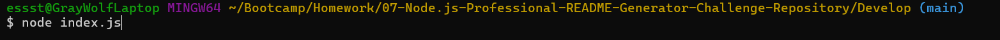
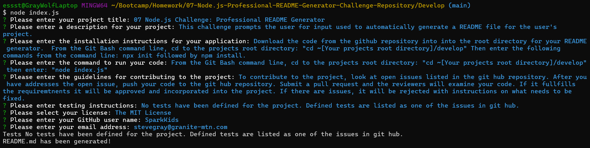

  # 07 Node.js Challenge: Professional README Generator

  

  ## Description

  This challenge prompts the user to answer questions about all the sections used in the README. The program then automatically generates a README file for the user's project. 
    
    
  ## Table of Contents 
       
  - [Installation](#installation)
  - [Usage](#usage)
  - [Contributing](#contributing)
  - [Tests](#tests)
  - [License](#license)
  - [Questions](#questions)
      
  ## Installation
      
  Download the code from the github repository into into the root directory for your README generator.  From the Git Bash command line, cd to the projects root directory: "cd ~[Your projects root directory]/develop" Then enter the following commands from the command line: npx init followed by npm install. 
  
  ## Usage
      
  From the Git Bash command line, cd to the projects root directory: "cd ~[Your projects root directory]/develop" then enter: "node index.js"

  

  Then answer the prompts as they display on the command line.

  

      
      
  ## Contributing

  To contribute to the project, look at open issues listed in the git hub repository. After you have addresses the open issue, push your code to the git hub repository. Submit a pull request and the reviewers will examine your code. If it fullfills the requiremtnents it will be approved and incorporated into the project. If there are issues, it will be rejected with instructions on what needs to be fixed.

  ## Tests

  No tests have been defined for the project. Defined tests are listed as one of the issues in git hub.
      
    
  ## License

  [The MIT License](https://opensource.org/licenses/MIT)

 
  ## Questions

  [GitHub SparkKids](https://github.com/SparkKids)

  [stevegray@granite-mtn.com](mailto:stevegray@granite-mtn.com)

    
    
  